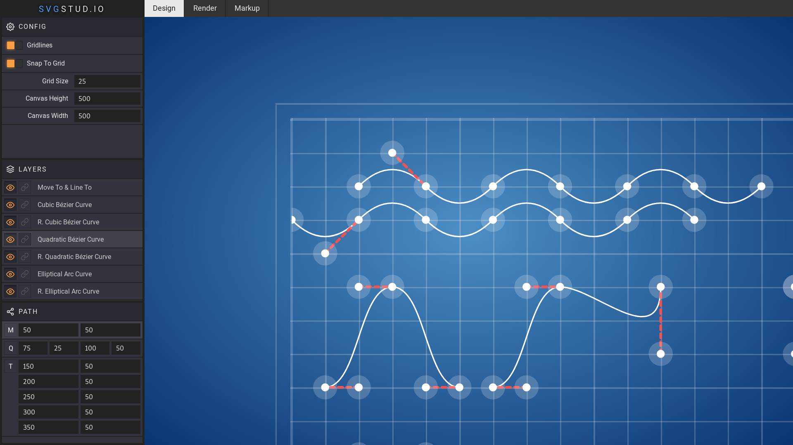

# SVG Editor

SVG Editor built with [Hybrids](https://github.com/hybridsjs/hybrids). Try it
live at [svgstud.io](https://svgstud.io/)!



## Usage

To install and launch dev server:

```
npm install
npm start
```

To build with production profile:

```
npm build
```
